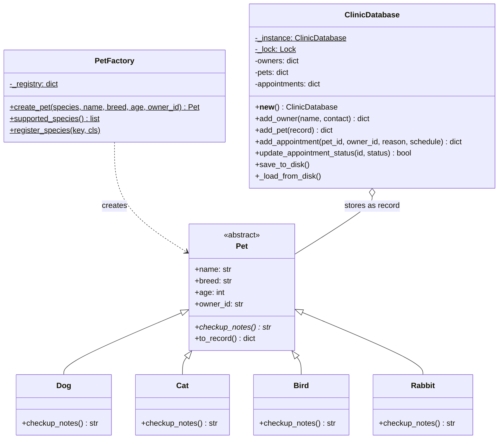
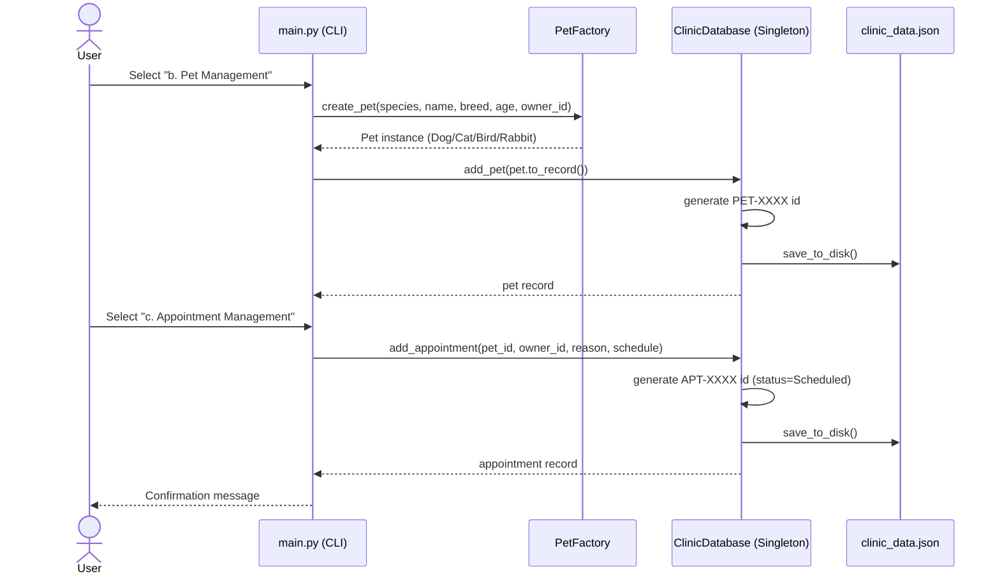

<div align="center">


<br/>


</div>

---

## 📖 Table of Contents

- [Academic Information](#-academic-information)
- [Project Overview](#-project-overview)
- [Architecture at a Glance](#-architecture-at-a-glance)
- [Booking Flow (Sequence Diagram)](#-booking-flow-sequence-diagram)
- [Project Structure](#-project-structure)
- [Task Distribution](#-task-distribution)
- [Setup and Installation](#-setup-and-installation)
- [Usage](#-usage)
- [Running Unit Tests](#-running-unit-tests-directly)

---

## 🎓 Academic Information

<table>
<tr><td><b>Course</b></td><td>CPE106L-4 Software Design Laboratory</td></tr>
<tr><td><b>Laboratory Exercise</b></td><td>Laboratory Report 4 — Design Patterns and Unit Testing</td></tr>
<tr><td><b>Program</b></td><td>BS Computer Engineering</td></tr>
<tr><td><b>Institution</b></td><td>Mapúa University</td></tr>
<tr><td><b>Collaborators</b></td><td>Edmarc Justin C. Oabel · Jabez Molar </td></tr>
</table>

---

## 🐾 Project Overview

Paws and Care Veterinary Clinic requires an automated appointment management system to reduce scheduling conflicts and streamline pet record tracking.

This project demonstrates two core design patterns and automated verification:

| Concept | Description |
|---|---|
| 🔒 **Singleton Pattern** | Manages a single, centralized in-memory clinic repository (`ClinicDatabase`) with thread-safe double-checked locking and auto-increment identifier counters. |
| 🏭 **Factory Pattern** | Provides an extensible interface (`PetFactory`) to instantiate polymorphic pet objects (`Dog`, `Cat`, `Bird`, `Rabbit`) without exposing concrete instantiation logic. |
| ✅ **Automated Unit Testing** | Complete test coverage via Python's built-in `unittest` framework validating singleton integrity, record registration, scheduling workflows, and status transitions. |
| 💾 **Persistence** | Auto-saves records to a local `clinic_data.json` storage file to maintain state between application restarts. |

---

## 🏗 Architecture at a Glance



---

## 🔁 Booking Flow (Sequence Diagram)



---

## 📂 Project Structure

```text
cpe106l-lab4-vet-clinic/
│
├── database.py       # Thread-safe Singleton database with ID generation & JSON persistence
├── pet_factory.py    # Pet abstraction and Factory pattern implementations
├── test_clinic.py    # Automated unit test suite (unittest)
├── main.py           # Command-Line Interface (CLI) navigation and test runner
└── README.md         # Project documentation
```

---

## 👥 Task Distribution

| Team Member | Role | Responsibilities |
| --- | --- | --- |
| **Edmarc Justin C. Oabel** | Person A (Core Architecture & Models) | Designed and implemented `database.py` (Singleton pattern, synchronized sequence counters, and JSON file persistence) and `pet_factory.py` (abstract Pet base class and PetFactory). |
| **Jabez Molar** | Person B (CLI & Automated Testing) | Implemented `main.py` (interactive CLI workflow and input handling) and `test_clinic.py` (test suite covering database assertions, factory instantiation, and appointment flows). |

---

## ⚙️ Setup and Installation

### Prerequisites

- Python 3.9 or newer installed on your machine.
- Git installed and configured.
- Visual Studio Code (or any preferred code editor).

### Clone the Repository

```bash
git clone https://github.com/<YOUR_GITHUB_USERNAME>/cpe106l-lab4-vet-clinic.git
cd cpe106l-lab4-vet-clinic
```

---

## 🚀 Usage

### Run the Application

To launch the interactive CLI:

```bash
python main.py
```

### CLI Menu Options

<details open>
<summary><b>a. Pet Owner Management</b></summary>
<br/>
Register a pet owner (auto-generates <code>OWN-XXXX</code>) and view existing owners.
</details>

<details open>
<summary><b>b. Pet Management (Factory implementation)</b></summary>
<br/>
Create and associate a pet record using <code>PetFactory</code> (auto-generates <code>PET-XXXX</code>).
</details>

<details open>
<summary><b>c. Appointment Management</b></summary>
<br/>
Book a visit (auto-generates <code>APT-XXXX</code>), view schedules, and update status (<code>Scheduled</code>, <code>Completed</code>, <code>Cancelled</code>).
</details>

<details open>
<summary><b>d. Run Unit Tests</b></summary>
<br/>
Execute the automated test suite directly from the CLI.
</details>

<details open>
<summary><b>e. Exit</b></summary>
<br/>
Close the application session.
</details>

---

## 🧪 Running Unit Tests Directly

Run the unit test runner in verbose mode:

```bash
python -m unittest -v test_clinic
```

<div align="center">


</div>
